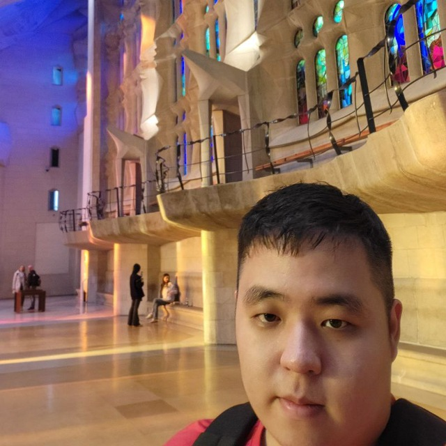
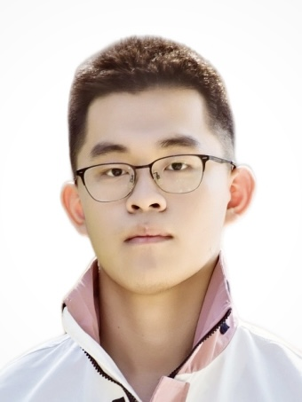

# About Us

We are a team based in the [School of Computing, National University of Singapore](http://www.comp.nus.edu.sg).

You can reach us at the email `seer[at]comp.nus.edu.sg`

## Project team

### Chua Bing Jian

[[github](https://github.com/cbj252)]
[[portfolio](team/cbj252.md)]

* Role: Developer
* Responsibilities: Team Lead

### Teo Zern

[[github](http://github.com/teozern1)]
[[portfolio](team/teozern1.md)]

* Role: Developer
* Responsibilities: Student Management Features

### Yuan Tianci Jackson

[[github](http://github.com/jacksonyuan256)] [[portfolio](team/jacksonyuan256.md)]

* Role: Developer
* Responsibilities: Module Management & Code Quality

### Alvis Ng

[[github](http://github.com/supermii2)]
[[portfolio](team/supermii2.md)]

* Role: Developer
* Responsibilities: Documentation & Testing

### Song Bingxi

[[github](http://github.com/propene-dan)]
[[portfolio](team/propene-dan.md)]

* Role: Developer
* Responsibilities: In charge of Tutorial
