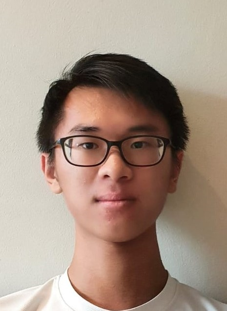
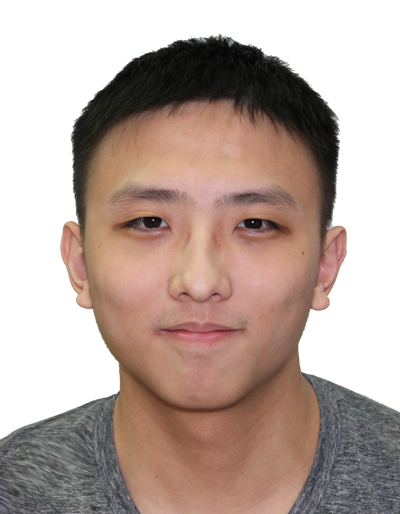

# About Us

We are a team based in the [School of Computing, National University of Singapore](http://www.comp.nus.edu.sg).

You can reach us at the email `seer[at]comp.nus.edu.sg`

## Project team

### Chua Bing Jian

[[github](https://github.com/cbj252)]
[[portfolio](team/cbj252.md)]

* Role: Project Advisor

### Teo Zern

[[github](http://github.com/teozern1)]
[[portfolio](team/teozern1.md)]

* Role: Developer
* Responsibilities: Student Management Features

### Yuan Tianci Jackson

[[github](http://github.com/jacksonyuan256)] [[portfolio](team/jackson.md)]

* Role: Developer
* Responsibilities: Data

### Jean Doe

[[github](http://github.com/johndoe)]
[[portfolio](team/johndoe.md)]

* Role: Developer
* Responsibilities: Dev Ops + Threading

### James Doe

[[github](http://github.com/johndoe)]
[[portfolio](team/johndoe.md)]

* Role: Developer
* Responsibilities: UI
