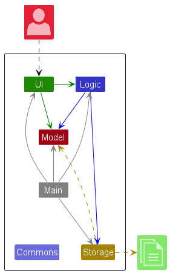
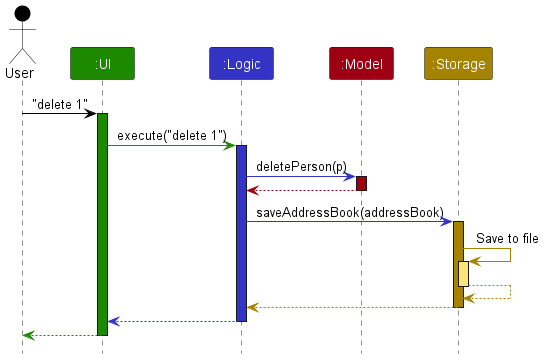
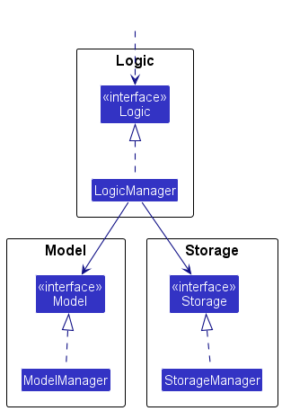
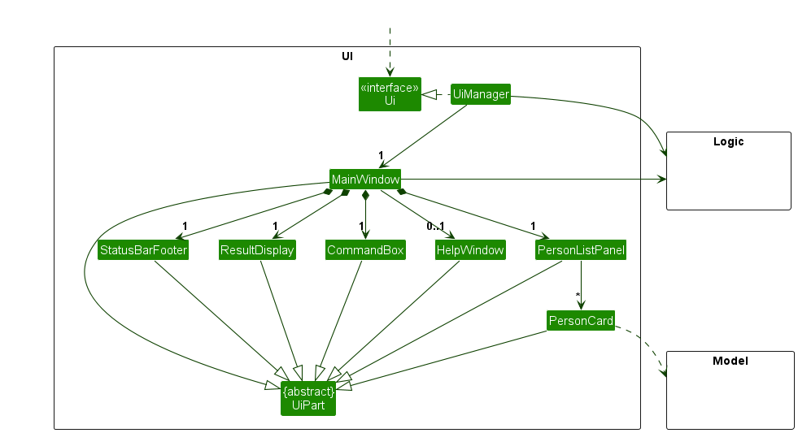
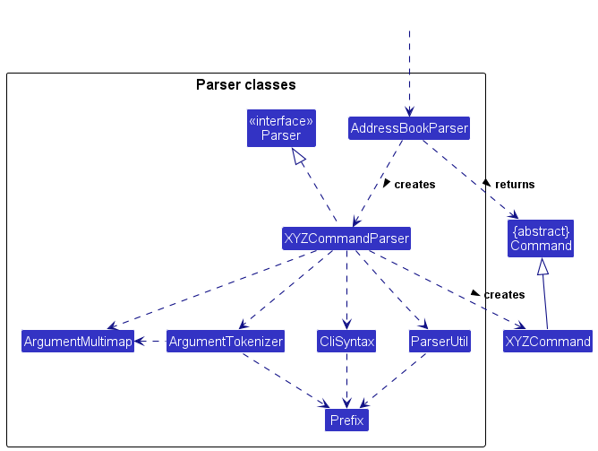
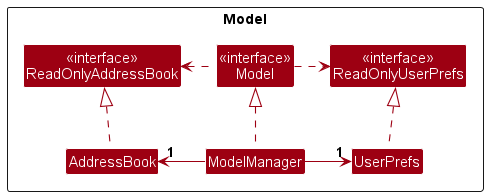
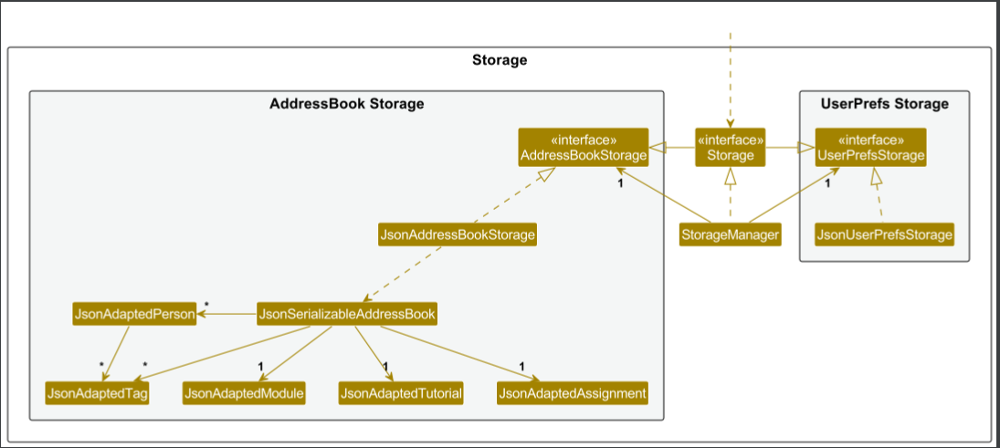
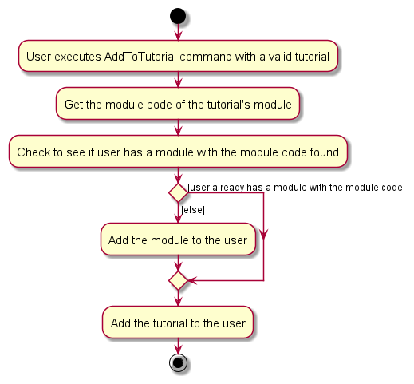

# TAssistant Developer Guide

<h2>Table of Contents</h2>

- **[Acknowledgements](#acknowledgements)**
- **[Setting up, getting started](#setting-up-getting-started)**
- **[Design](#design)**
- **[Architecture](#architecture)**
    * [UI Component](#ui-component)
    * [Logic Component](#logic-component)
    * [Model Component](#model-component)
    * [Storage Component](#storage-component)
- **[Implementation](#implementation)**
    * [Module-Tutorial Interaction](#module-tutorial-interaction)
- **[Documentation, logging, testing, configuration, dev-ops](#documentation-logging-testing-configuration-dev-ops)**
- **[Appendix: Requirements](#appendix-requirements)**
    * [Product Scope](#product-scope)
    * [User Stories](#user-stories)
    * [Use Cases](#use-cases)
    * [Non-functional Requirements](#non-functional-requirements)
    * [Glossary](#glossary)
- **[Appendix: Instructions for manual testing](#appendix-instructions-for-manual-testing)**
    * [Launch and shutdown](#launch-and-shutdown)
    * [Deleting a person](#deleting-a-person)
    * [Adding modules](#adding-modules)
    * [Recording attendance](#recording-attendance)
    * [Adding tutorials](#adding-tutorials)
    * [Saving data](#saving-data)

--------------------------------------------------------------------------------------------------------------------

## **Acknowledgements**

_{ list here sources of all reused/adapted ideas, code, documentation, and third-party libraries -- include links to the original source as well }_

--------------------------------------------------------------------------------------------------------------------

## **Setting up, getting started**

Refer to the guide [_Setting up and getting started_](SettingUp.md).

--------------------------------------------------------------------------------------------------------------------

## **Design**

### Architecture

The ***Architecture Diagram*** given above explains the high-level design of the App.

Given below is a quick overview of main components and how they interact with each other.

**Main components of the architecture**

**`Main`** (consisting of classes [`Main`](https://github.com/se-edu/addressbook-level3/tree/master/src/main/java/seedu/address/Main.java) and [`MainApp`](https://github.com/se-edu/addressbook-level3/tree/master/src/main/java/seedu/address/MainApp.java)) is in charge of the app launch and shut down.
* At app launch, it initializes the other components in the correct sequence, and connects them up with each other.
* At shut down, it shuts down the other components and invokes cleanup methods where necessary.

The bulk of the app's work is done by the following four components:

* [**`UI`**](#ui-component): The UI of the App.
* [**`Logic`**](#logic-component): The command executor.
* [**`Model`**](#model-component): Holds the data of the App in memory.
* [**`Storage`**](#storage-component): Reads data from, and writes data to, the hard disk.

[**`Commons`**](#common-classes) represents a collection of classes used by multiple other components.

**How the architecture components interact with each other**

The *Sequence Diagram* below shows how the components interact with each other for the scenario where the user issues the command `delete 1`.

Each of the four main components (also shown in the diagram above),

* defines its *API* in an `interface` with the same name as the Component.
* implements its functionality using a concrete `{Component Name}Manager` class (which follows the corresponding API `interface` mentioned in the previous point.

For example, the `Logic` component defines its API in the `Logic.java` interface and implements its functionality using the `LogicManager.java` class which follows the `Logic` interface. Other components interact with a given component through its interface rather than the concrete class (reason: to prevent outside component's being coupled to the implementation of a component), as illustrated in the (partial) class diagram below.

The sections below give more details of each component.

### UI component

The **API** of this component is specified in [`Ui.java`](https://github.com/se-edu/addressbook-level3/tree/master/src/main/java/seedu/address/ui/Ui.java)

The UI consists of a `MainWindow` that is made up of parts e.g.`CommandBox`, `ResultDisplay`, `PersonListPanel`, `StatusBarFooter` etc. All these, including the `MainWindow`, inherit from the abstract `UiPart` class which captures the commonalities between classes that represent parts of the visible GUI.

The `UI` component uses the JavaFx UI framework. The layout of these UI parts are defined in matching `.fxml` files that are in the `src/main/resources/view` folder. For example, the layout of the [`MainWindow`](https://github.com/se-edu/addressbook-level3/tree/master/src/main/java/seedu/address/ui/MainWindow.java) is specified in [`MainWindow.fxml`](https://github.com/se-edu/addressbook-level3/tree/master/src/main/resources/view/MainWindow.fxml)

The `UI` component,

* executes user commands using the `Logic` component.
* listens for changes to `Model` data so that the UI can be updated with the modified data.
* keeps a reference to the `Logic` component, because the `UI` relies on the `Logic` to execute commands.
* depends on some classes in the `Model` component, as it displays `Person` object residing in the `Model`.

### Logic component

**API** : [`Logic.java`](https://github.com/se-edu/addressbook-level3/tree/master/src/main/java/seedu/address/logic/Logic.java)

Here's a (partial) class diagram of the `Logic` component:

The sequence diagram below illustrates the interactions within the `Logic` component, taking `execute("delete 1")` API call as an example.

<box type="info" seamless>

**Note:** The lifeline for `DeleteCommandParser` should end at the destroy marker (X) but due to a limitation of PlantUML, the lifeline reaches the end of diagram.
</box>

How the `Logic` component works:

1. When `Logic` is called upon to execute a command, it is passed to an `AddressBookParser` object which in turn creates a parser that matches the command (e.g., `DeleteCommandParser`) and uses it to parse the command.
1. This results in a `Command` object (more precisely, an object of one of its subclasses e.g., `DeleteCommand`) which is executed by the `LogicManager`.
1. The command can communicate with the `Model` when it is executed (e.g. to delete a person).
1. The result of the command execution is encapsulated as a `CommandResult` object which is returned back from `Logic`.

Here are the other classes in `Logic` (omitted from the class diagram above) that are used for parsing a user command:

How the parsing works:
* When called upon to parse a user command, the `AddressBookParser` class creates an `XYZCommandParser` (`XYZ` is a placeholder for the specific command name e.g., `AddCommandParser`) which uses the other classes shown above to parse the user command and create a `XYZCommand` object (e.g., `AddCommand`) which the `AddressBookParser` returns back as a `Command` object.
* All `XYZCommandParser` classes (e.g., `AddCommandParser`, `DeleteCommandParser`, ...) inherit from the `Parser` interface so that they can be treated similarly where possible e.g, during testing.

### Model component
**API** : [`Model.java`](https://github.com/se-edu/addressbook-level3/tree/master/src/main/java/seedu/address/model/Model.java)

* Note: For the Person class, fields such as "Name", "Email" and "Phone" have been integrated into Person_Fields to
simplify the diagram. The Person_Fields class does not exist and is meant to represent the less important fields in
Person, such as "Name", "Email" and "Phone" that have similar attributes.

The `Model` component,

* stores the address book data i.e., all `Person`, `Module`, `Tutorial`, `Assignment` objects 
(which are contained in a `UniquePersonList`, `UniqueModuleList`, `UniqueTutorialList`, `UniqueAssignmentList` object).
* stores the currently 'selected' `Person` objects (e.g., results of a search query) 
as a separate _filtered_ list which is exposed to outsiders as an unmodifiable `ObservableList<Person>` 
that can be 'observed' e.g. the UI can be bound to this list so that the UI automatically updates when the data in the list change.
* `Module`, `Tutorial` and `Assignment` objects are stored in a similar way, as a separate list that the UI
automatically updates as the data in the list changes. However, since the UI always shows all modules, tutorials and
assignments the user has (i.e. there is no filtering for Modules, Tutorials and Assignments), the list exposed to
outsiders is always guaranteed to be the full list of Modules, Tutorials or Assignments.
* stores a `UserPref` object that represents the user’s preferences. 
This is exposed to the outside as a `ReadOnlyUserPref` objects.
* does not depend on any of the other three components 
(as the `Model` represents data entities of the domain, they should make sense on their own without depending on other components)

### Storage component

**API** : [`Storage.java`](https://github.com/se-edu/addressbook-level3/tree/master/src/main/java/seedu/address/storage/Storage.java)

The `Storage` component,
* can save both address book data and user preference data in JSON format, and read them back into corresponding objects.
* inherits from both `AddressBookStorage` and `UserPrefStorage`, which means it can be treated as either one (if only the functionality of only one is needed).
* depends on some classes in the `Model` component (because the `Storage` component's job is to save/retrieve objects that belong to the `Model`)

### Common classes

Classes used by multiple components are in the `seedu.addressbook.commons` package.

--------------------------------------------------------------------------------------------------------------------

## **Implementation**

This section describes some noteworthy details on how certain features are implemented.

### **Module-Tutorial Interaction**

In NUS, modules are a unit of study, and most modules require students to participate in tutorials. Each
module with tutorials has one or more tutorials, but each tutorial is usually only for one module. Given that Teaching
Assistants usually only teach tutorials rather than a module as a whole, we considered only including tutorials in our
product, but decided against it because having both modules and tutorials allows for more convenient searching for
teaching assistants teaching multiple modules. This comes at the cost of having to maintain the multiplicity between
module and tutorials.

To better enable advanced users, the app automatically performs actions to maintain the multiplicity constraint rather
than force the user to type additional commands to maintain it. For example, the AddToTutorial command adds a
tutorial to a person and the corresponding module should they not have it.

--------------------------------------------------------------------------------------------------------------------

## **Documentation, logging, testing, configuration, dev-ops**

* [Documentation guide](Documentation.md)
* [Testing guide](Testing.md)
* [Logging guide](Logging.md)
* [Configuration guide](Configuration.md)
* [DevOps guide](DevOps.md)

--------------------------------------------------------------------------------------------------------------------

## **Appendix: Requirements**

### Product scope

**Target user profile**:

* NUS SoC teaching assistants
* Has to tutor multiple tutorials, potentially in multiple modules
* prefer desktop apps over other types
* can type fast
* prefers typing to mouse interactions
* is reasonably comfortable using CLI apps

**Value proposition**: manage the students, fellow tutors and professors involved in tutoring faster than a typical mouse/GUI driven app

### User stories

Priorities: High (must have) - `* * *`, Medium (nice to have) - `* *`, Low (unlikely to have) - `*`

| Priority | As a …​ | I want to …​                                                        | So that I can…​                                                               |
|----------|---------|---------------------------------------------------------------------|-------------------------------------------------------------------------------|
| `* * *`  | user    | search for professors for a module                                  | quickly search for the professor that is conducting the module I am TAing for |
| `* * *`  | user    | search for all my students in a module                              | manage them more easily                                                       |
| `* * *`  | user    | read information about students, modules and tutorials from a file  | keep any students added or closed even after closing the program              |
| `* * *`  | user    | view my students school email and telegram handle                   | contact them if needed                                                        |
| `* * *`  | user    | sign up as a TA of module(s)                                        | manage what modules I am part of                                              |
| `* * *`  | user    | add and delete lessons                                              | it is easier for me to organise my schedule.                                  |
| `* * *`  | user    | filter students by tutorials and module                             | make preparations based on upcoming classes, like marking their work          |
| `* * *`  | user    | add and remove students to tutorials	                               | it is easier for me to organise my schedule.                                  |
| `* *`    | user    | edit the information of students                                    | rectify any mistakes made for personal information and grades.                |
| `* *`    | user    | view my professors' email in the same mod                           | easily reach out to them for updates or help.                                 |
| `* *`    | user    | edit the tutorials I teach                                          | it does not conflict with any of my other tutorials.                          |
| `* *`    | user    | export the attendance list as a pdf                                 | submit it to the people in charge                                             |

### Use cases

(For all use cases below, the **System** is the `AddressBook` and the **Actor** is the `user`, unless specified otherwise)

**Use case: Searching for a student within a module**

**MSS**

1.  User requests to list persons in the module.
2.  System shows the persons in the module.

    Use case ends.

**Extensions**

* 2a. The module does not exist.

  * 2a1. AddressBook shows an error message informing the user.

  Use case ends.

* 3a. The module exists, but no one is part of the module.

    * 3a1. No one is displayed.
    * 3a2. The display states that "No users are found".

    Use case ends.

**Use case: Deleting a module**

**MSS**

1. User requests to delete a module and provides its index.
2. System deletes the module.

    Use case ends.

**Extensions**

* 1a. The user gives a non-integer index, negative index, or omits it.

    * 1a1. System shows an error message informing the user that they need to specify an integer index.

  Use case ends.

* 1b. The index given is higher than the number of modules the user has.

  * 1b1. System shows an error message informing the user the module cannot be found.

  Use case ends.

* 2a. There are people in the address book that are part of the module.

    * 2a1. System deletes the modules (and related tutorials, if any) from everyone in the address book.
    * 2a2. System deletes the module.

  Use case ends.

**Use case: Deleting a tutorial**

**MSS**

1. User requests to delete a tutorial and provides its index.
2. System deletes the tutorial.

    Use case ends.

**Extensions**

* 1a. The user gives a non-integer index, negative index, or omits it.

    * 1a1. System shows an error message informing the user that they need to specify an integer index.

  Use case ends.

* 1a. The index given is higher than the number of tutorials the user has.

    * 1a1. System shows an error message informing the user the tutorial cannot be found.

  Use case ends.

* 2a. There are people in the address book that are part of the tutorial.

    * 2a1. System deletes the tutorial from everyone in the address book.
    * 2a2. System deletes the tutorial.

  Use case ends.

**Use case: Recording attendance for a person**

**MSS**

1. User requests to take attendance, specifying the index of the person and the lesson name.
2. System updates the displayed tags of the person.

   Use case ends.

**Extensions**

* 1a. The user gives a non-integer index, negative index, or omits it.

    * 1a1. System shows an error message informing the user that they need to specify an integer index.

  Use case ends.

* 1b. The index given is higher than the number of persons in the list.

    * 1b1. System shows an error message informing the user the person cannot be found.

  Use case ends.

* 2a. The given lesson name already exists.
    * 2a1. System shows an error message informing the user it is a duplicate.

  Use case ends.

### Non-Functional Requirements

1.  Should work on any _mainstream OS_ as long as it has Java `11` or above installed.
2.  Should be able to hold up to 1000 persons without a noticeable sluggishness in performance for typical usage.
3.  Should be able to hold up to 10 modules without a noticeable sluggishness in performance for typical usage.
4.  Should be able to hold up to 10 tutorials without a noticeable sluggishness in performance for typical usage.
5.  A user with above average typing speed for regular English text (i.e. not code, not system admin commands) 
should be able to accomplish most of the tasks faster using commands than using the mouse.
6.  The product is meant for a single Teaching Assistant that makes all changes to the AddressBook themselves.
7.  Data will be stored in a .json file to allow for advanced users to manipulate the data directly.
8.  The product does not require the Internet to operate.

### Glossary

* **Mainstream OS**: Windows, Linux, Unix, OS-X
* **Teaching Assistant (TA)**: A non-professor tutor which helps the professors of a module by teaching one or more classes.
* **Module**: A unit of study in a specific field set by NUS, such as CS2103T focusing on Software Engineering.
* **Tutorial**: Lessons that are part of a module. Includes laboratories, recitations, tutorials and any form of lesson that includes a TA.

--------------------------------------------------------------------------------------------------------------------

## **Appendix: Instructions for manual testing**

Given below are instructions to test the app manually.

<box type="info" seamless>

**Note:** These instructions only provide a starting point for testers to work on;
testers are expected to do more *exploratory* testing.

</box>

### Launch and shutdown

1. Initial launch

   1. Download the jar file and copy into an empty folder

   1. Double-click the jar file Expected: Shows the GUI with a set of sample contacts. The window size may not be optimum.

1. Saving window preferences

   1. Resize the window to an optimum size. Move the window to a different location. Close the window.

   1. Re-launch the app by double-clicking the jar file. 
       Expected: The most recent window size and location is retained.

1. _{ more test cases …​ }_

### Deleting a person

1. Deleting a person while all persons are being shown

   1. Prerequisites: List all persons using the `list` command. Multiple persons in the list.

   1. Test case: `delete 1` 
      Expected: First contact is deleted from the list. Details of the deleted contact shown in the status message. Timestamp in the status bar is updated.

   1. Test case: `delete 0` 
      Expected: No person is deleted. Error details shown in the status message. Status bar remains the same.

   1. Other incorrect delete commands to try: `delete`, `delete x`, `...` (where x is larger than the list size) 
      Expected: Similar to previous.

### Adding Modules

1. Adding a module
   1. Prerequisites: None.

   1. Test case: `addModule m/CS21OO` 
      Expected: The module is added to the module list and it should show up on the GUI. 
      The displayed name on the GUI will always be capitalised.

   1. Test case: `addModule m/DTXK323000` 
      Expected: No module is added. Error details shown in the status message. Module list remains the same.

   1. Other incorrect delete commands to try: `addModule m/`, `addModule m/HSA`  
      Expected: Similar to previous.
   
### Adding Tutorials

1. Adding a tutorial
   1. Prerequisites: A module has been created. This guide will assume that a module with module code "CS2103" has been
   created, but modules with different module codes may be used. The tutorials in the test cases below should not be
   created before the tests.

   1. Test case: `addTutorial m/CS2103 tn/T10 tt/Mon 6PM` 
       Expected: Details of the tutorial added to the tutorial list. Details of the added tutorial shown in the status message.

   1. Test case: `addTutorial m/CS2103 tn/ tt/Mon 6PM` 
       Expected: No tutorial is added. Error details regarding empty tutorial name shown in the status message.
       Tutorial list remains the same.

   1. Other incorrect commands to try: `addTutorial `, `addTutorial randomString`, `addTutorial tn/T10 tt/Mon 6PM`  
        Expected: Similar to previous.

### Recording attendance

1. Recording attendance for a person
    1. Prerequisites: At least one person must exist in the displayed list.

    1. Test case: `attn 1 ln/S1` 
       Expected: A tag with the description "S1" should appear on the first person on the list. 
       A message should be displayed indicating that the attendance was successfully taken.

    1. Test case: `attn 1 ln/$$TEXT` 
       Expected: An error message should be displayed indicating that the tag name must be alphanumeric.
   
    1. Test case: `attn -2 ln/S1` 
       Expected: An error message should be displayed indicating that the INDEX must be an unsigned integer.

    1. Other incorrect delete commands to try: `attn 1 ln/`, `attn 2 ln/09%^&`  
       Expected: Similar to previous.

### Saving data

1. Dealing with missing/corrupted data files

   1. _{explain how to simulate a missing/corrupted file, and the expected behavior}_

1. _{ more test cases …​ }_

--------------------------------------------------------------------------------------------------------------------

## **Appendix: Planned Enhancements**

1. Currently, the addToModule command, when used on a user that already has the given module, does not give an
error message. We intend to change this so that the addToModule command when used on a user that already has the given
module will now give the error message `User already has the given module` in the output box.
